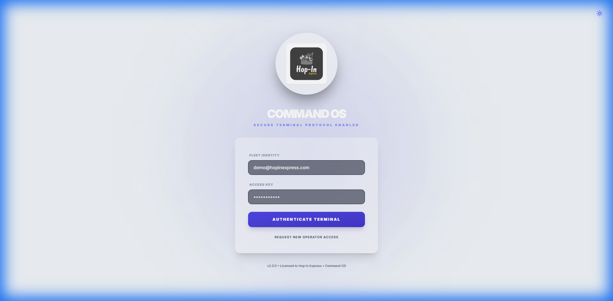
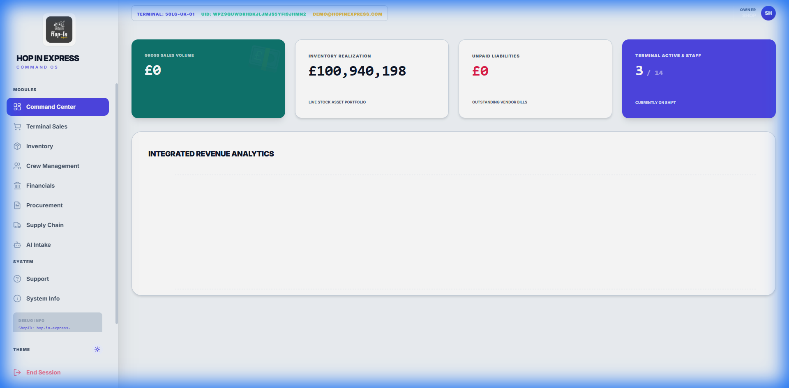
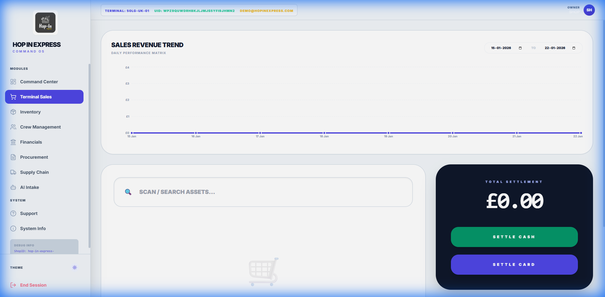
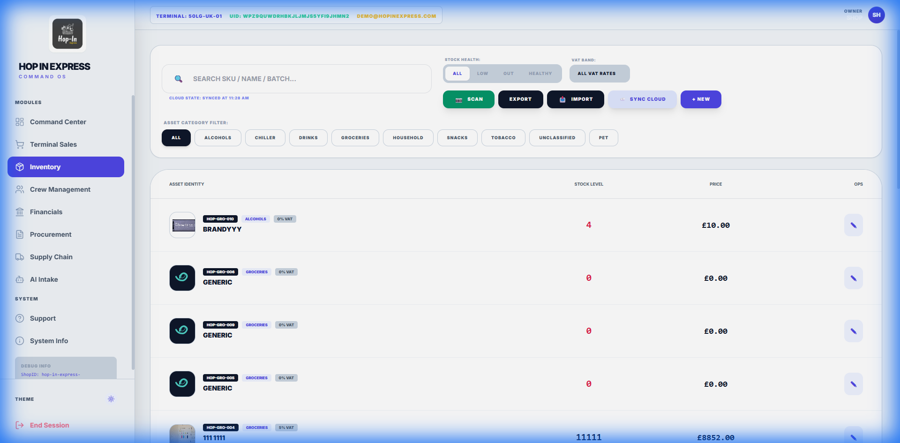
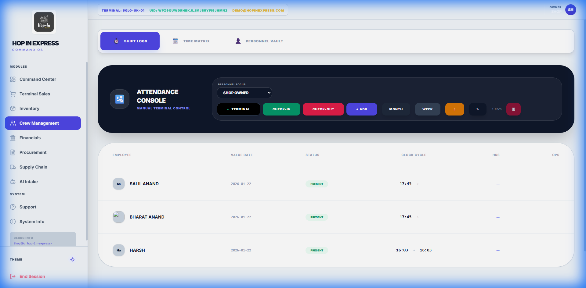
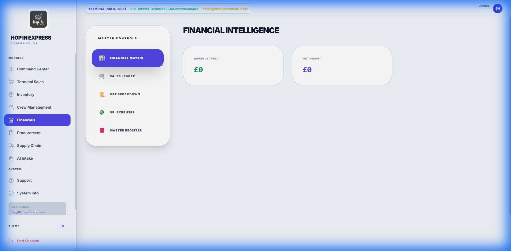
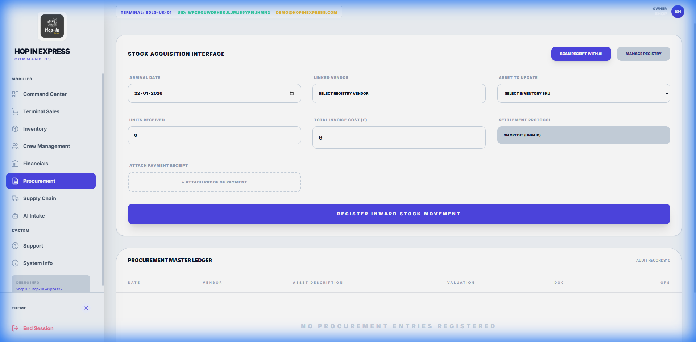
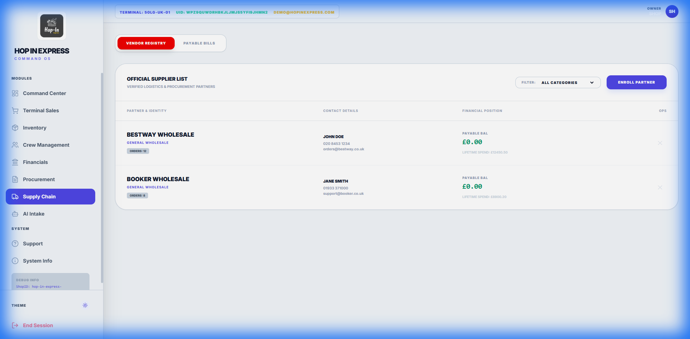
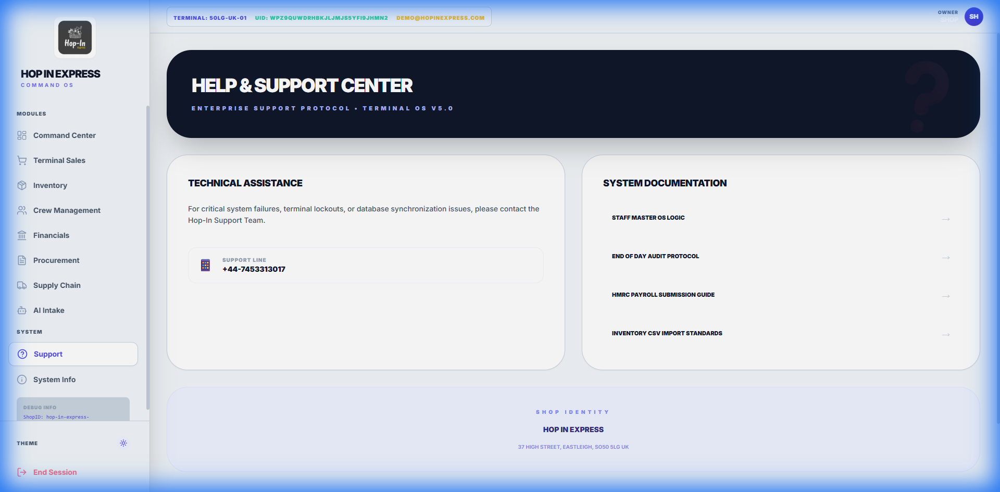

# <!-- fit --> **Hop In Express Command OS**
## User Guide & System Walkthrough (Light Mode)

---

## **Table of Contents**

1.  **System Access**: Login & Security
2.  **Command Center**: Dashboard & Analytics
3.  **Terminal Sales**: EPOS Operations
4.  **Inventory**: Asset Management
5.  **Crew Management**: Staff & Rota
6.  **Financials**: Ledger & Profit Analysis
7.  **Supply Chain**: Procurement & Suppliers
8.  **Support**: Help & Documentation

---

## **1. System Access**
### Secure Authentication

- **Secure Login**: Access the terminal using your **Fleet Identity** (Email) and **Access Key**.
- **Branding**: The interface features the new **Hop In Express** identity with a clean, high-contrast light theme.
- **Theme Toggle**: Users can switch between **Light** and **Dark** modes based on lighting conditions.
- **Registration**: New operators can request access via the "Request New Operator Access" link.

---

## **2. Command Center**
### Real-Time Operational Overview

- **Metrics**: Monitor **Gross Sales**, **Inventory Valuation**, and **Staff Activity** in real-time.
- **Notifications**: See critical alerts for stock levels or system updates.
- **Quick Links**: Access frequently used modules directly from the dashboard cards.
- **Analytics**: View integrated revenue graphs (when data is populated).

---

## **3. Terminal Sales (EPOS)**
### Point of Sale Interface

- **Sales Processing**: Scan items seamlessly to add them to the cart.
- **Search**: Manually search for products if barcodes are unreadable.
- **Payment Modes**: Accept **Cash** or **Card** payments natively.
- **Shift Management**: Track current shift sales and perform cash drops.

---

## **4. Inventory Management**
### Asset Tracking & Control

- **Stock List**: View all products with images, stock levels, and pricing.
- **Low Stock Alerts**: Items needing replenishment are highlighted.
- **Editing**: Managers can update prices, stock counts, and suppliers directly.
- **Bulk Actions**: Import/Export inventory data for large updates.

---

## **5. Crew Management**
### Staff & Attendance Rota

- **Staff List**: View all active personnel and their roles.
- **On-Shift Status**: Real-time indicator of who is currently clocked in.
- **Performance**: Track sales performance per staff member.
- **Management**: Administer roles, PINs, and access levels (RBAC).

---

## **6. Financials**
### Ledger & Profitability

- **General Ledger**: A comprehensive record of all financial transactions (Sales, Expenses, Purchases).
- **Profit & Loss**: View calculated Net Profit based on COGS and Revenue.
- **Export**: Download financial reports for accounting purposes.

---

## **7. Procurement**
### Purchase Orders & Stock Intake

- **Purchase Orders**: Log new stock purchases from suppliers.
- **Stock Updates**: Automatically updates inventory counts upon verifying delivery.
- **Documentation**: Upload invoice images for digital record-keeping.

---

## **8. Supply Chain**
### Vendor Management

- **Supplier Database**: Manage contact details and agreements for all vendors.
- **Performance**: Track fulfillment rates and delivery times (future feature).
- **Linking**: Associate specific products with preferred suppliers.

---

## **9. Support Center**
### Help & Documentation

- **Knowledge Base**: Access guides on POS operation, closing procedures, and staff policies.
- **Contact Support**: Direct line to **Hop-In Support Team** for technical issues.
- **System Info**: View current version and license details.

---

# **Thank You**
### Empowering Retail Excellence

**Hop In Express Command OS**
*v2.0.0*
